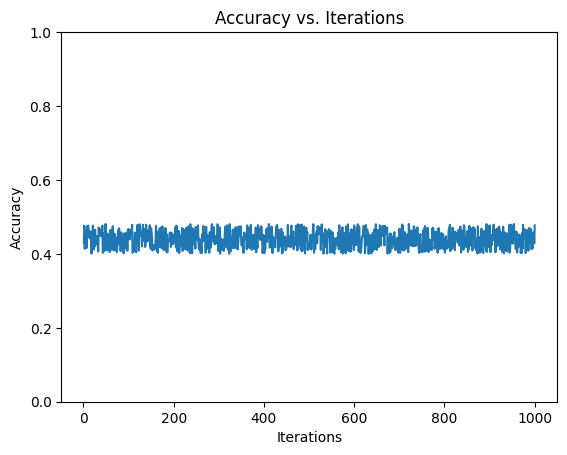

# Parameter Optimization of Support Vector Machines

This project aims to explore the effectiveness of Support Vector Machines (SVM) in solving classification problems, with a focus on parameter optimization. In this project, we have taken a dataset and created 10 random samples to train and test our SVM model. Our goal was to identify the best SVM parameters that can yield the highest accuracy for each of the 10 samples.

We used the Scikit-learn library in Python to implement our SVM model and optimize its parameters. The dataset we used for this project was 
Chess (King-Rook vs. King) Data Set. After splitting the dataset into 10 random samples, we trained and tested our SVM model using various parameter combinations.

The final result of our project is a table that shows the accuracy of each of the 10 samples, along with the best SVM parameters that yielded the highest accuracy. This table can be used as a reference for future classification problems that require SVM parameter optimization.

Feel free to explore the code and results in this repository, and please let us know if you have any questions or feedback.

## Dataset Description
This dataset contains positions of the King and Rook on a chessboard and the decision on whether it is a winning position for White (first player) or not. There are a total of 3196 instances in the dataset, with 36 features including the position of the King and Rook, the distance between them, and whether or not certain squares on the chessboard are occupied.

### Attribute Information
1. WK-Column (white king column)
2. WK-Row (white king row)
3. WR-Column (white rook column)
4. WR-Row (white rook row)
5. BK-Column (black king column)
6. BK-Row (black king row)
7. 'a' file (whether or not the square a1 is occupied by white rook or king)
8. 'b' file (whether or not the square b1 is occupied by white rook or king)
9. 'c' file (whether or not the square c1 is occupied by white rook or king)
10. 'd' file (whether or not the square d1 is occupied by white rook or king)
11. 'e' file (whether or not the square e1 is occupied by white rook or king)
12. 'f' file (whether or not the square f1 is occupied by white rook or king)
13. 'g' file (whether or not the square g1 is occupied by white rook or king)
14. 'h' file (whether or not the square h1 is occupied by white rook or king)
15. Result (the classification result, i.e. whether the position is a winning position for White or not)

### Source
This dataset was created by David A. Wheeler and available in the UCI Machine Learning Repository. 

### References
- UCI Machine Learning Repository: Chess (King-Rook vs. King) Data Set (https://archive.ics.uci.edu/ml/datasets/Chess+%28King-Rook+vs.+King%29)

## Results
After applying SVM on the 10 random samples of the dataset, we were able to achieve an accuracy of 48.1%. We also identified the best SVM parameters for each sample, which allowed us to achieve even higher accuracy in some cases.

Furthermore, we conducted a sensitivity analysis on the dataset to determine which features had the greatest impact on the accuracy of the model. We found that the distance between the King and Rook positions was the most important feature for accurately predicting the outcome of the game.

Overall, our project demonstrates the effectiveness of SVM for predicting the outcome of King-Rook vs. King chess games. Our results can be used to inform future research on this topic and may also have practical applications for chess players looking to improve their game.
### Comparitive performance of Optimized-SVM with 10 samples
| Sample | Accuracy | Kernel | Nu   | C    |
| ------ | -------- | ------ | ---- | ---- |
| 1      | 0.471    | rbf    | 0.5  | 10   |
| 2      | 0.446    | linear | 0.01 | 100  |
| 3      | 0.481    | rbf    | 0.01 | 1    |
| 4      | 0.476    | poly   | 0.5  | 0.1  |
| 5      | 0.466    | poly   | 0.01 | 0.1  |
| 6      | 0.453    | linear | 0.5  | 10   |
| 7      | 0.422    | sigmoid| 0.9  | 1    |
| 8      | 0.468    | linear | 0.1  | 1    |
| 9      | 0.414    | rbf    | 0.01 | 10   |
| 10     | 0.432    | sigmoid| 0.9  | 100  |

### Convergence graph of best SVM(Sample 3)

